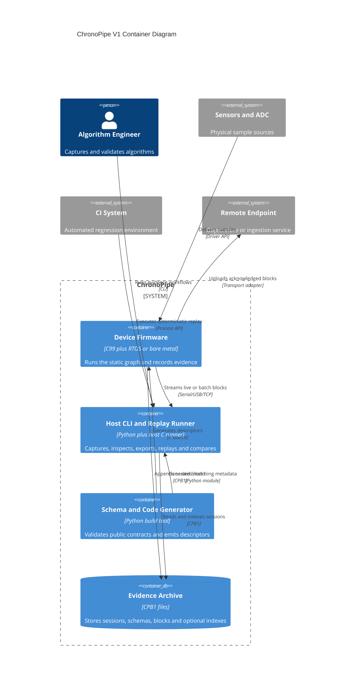

# Container architecture

```mermaid
C4Container
  title ChronoPipe V1 Container Diagram

  Person(algorithmEngineer, "Algorithm Engineer", "Captures and validates algorithms")
  System_Ext(sensorHardware, "Sensors and ADC", "Physical sample sources")
  System_Ext(ciSystem, "CI System", "Automated regression environment")
  System_Ext(remoteEndpoint, "Remote Endpoint", "Object store or ingestion service")

  System_Boundary(chronopipe, "ChronoPipe") {
    Container(deviceFirmware, "Device Firmware", "C99 plus RTOS or bare metal", "Runs the static graph and records evidence")
    Container(hostTools, "Host CLI and Replay Runner", "Python plus host C runner", "Captures, inspects, exports, replays and compares")
    Container(schemaGenerator, "Schema and Code Generator", "Python build tool", "Validates public contracts and emits descriptors")
    ContainerDb(evidenceArchive, "Evidence Archive", "CPB1 files", "Stores sessions, schemas, blocks and optional indexes")
  }

  Rel(sensorHardware, deviceFirmware, "Delivers samples", "Driver API")
  Rel(schemaGenerator, deviceFirmware, "Generates descriptors", "C source")
  Rel(schemaGenerator, hostTools, "Generates matching metadata", "Python module")
  Rel(deviceFirmware, evidenceArchive, "Appends sealed blocks", "CPB1")
  Rel(deviceFirmware, hostTools, "Streams live or batch blocks", "Serial/USB/TCP")
  Rel(deviceFirmware, remoteEndpoint, "Uploads acknowledged blocks", "Transport adapter")
  Rel(hostTools, evidenceArchive, "Reads and indexes sessions", "CPB1")
  Rel(algorithmEngineer, hostTools, "Runs evidence workflows", "CLI")
  Rel(ciSystem, hostTools, "Executes deterministic replay", "Process API")

  UpdateLayoutConfig($c4ShapeInRow="3", $c4BoundaryInRow="1")
```

Legend: containers are runnable or deployable units. The C runtime is linked inside
Device Firmware and is therefore shown as components, not as a separate service.
