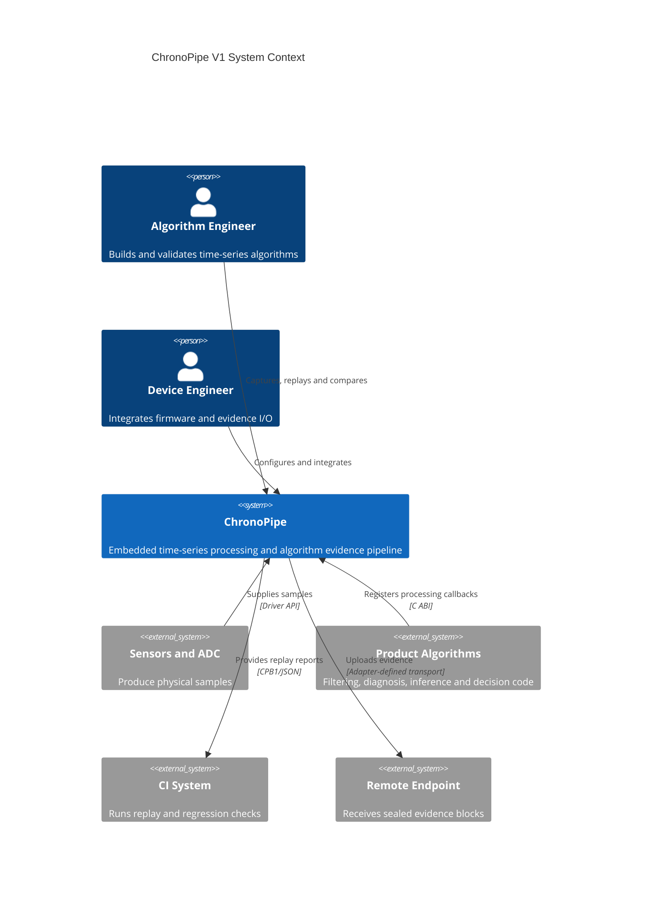

# System context

```mermaid
C4Context
  title ChronoPipe V1 System Context

  Person(algorithmEngineer, "Algorithm Engineer", "Builds and validates time-series algorithms")
  Person(deviceEngineer, "Device Engineer", "Integrates firmware and evidence I/O")
  System(chronopipe, "ChronoPipe", "Embedded time-series processing and algorithm evidence pipeline")
  System_Ext(sensorHardware, "Sensors and ADC", "Produce physical samples")
  System_Ext(productAlgorithms, "Product Algorithms", "Filtering, diagnosis, inference and decision code")
  System_Ext(ciSystem, "CI System", "Runs replay and regression checks")
  System_Ext(remoteEndpoint, "Remote Endpoint", "Receives sealed evidence blocks")

  Rel(sensorHardware, chronopipe, "Supplies samples", "Driver API")
  Rel(productAlgorithms, chronopipe, "Registers processing callbacks", "C ABI")
  Rel(deviceEngineer, chronopipe, "Configures and integrates")
  Rel(algorithmEngineer, chronopipe, "Captures, replays and compares")
  Rel(chronopipe, ciSystem, "Provides replay reports", "CPB1/JSON")
  Rel(chronopipe, remoteEndpoint, "Uploads evidence", "Adapter-defined transport")

  UpdateLayoutConfig($c4ShapeInRow="3", $c4BoundaryInRow="1")
```

Legend: people operate or integrate ChronoPipe; external systems are black boxes;
arrows name the initiating data or control action.
